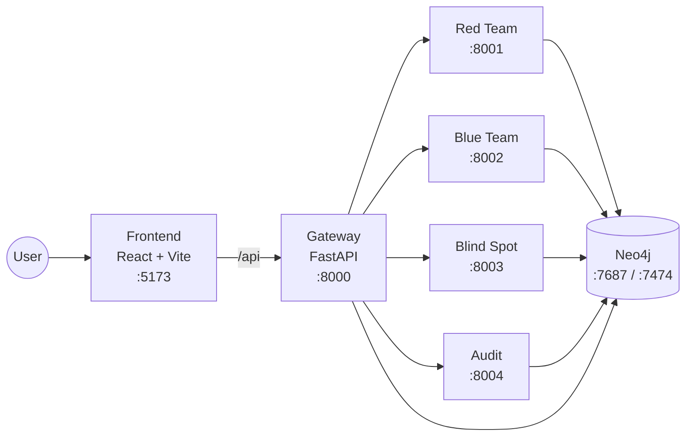

# HARIS Security Platform

HARIS is a Neo4j-backed cybersecurity platform that combines red-team simulation and blue-team detection workflows with auditable outputs.

The repository is a monorepo composed of:

- FastAPI services (`api/`)
  - gateway (`:8000`)
  - redteam (`:8001`)
  - blueteam (`:8002`)
  - blindspot (`:8003`)
  - audit (`:8004`)
- React + Vite frontend (`frontend/`, `:5173`)
- Neo4j init and seed scripts (`neo4j/init/`)
- Data/model assets and operational scripts (`data/`, `scripts/`)

## System Architecture



### Core runtime flow

1. Frontend sends `/api/*` requests to the Gateway.
2. Gateway exposes the shared `/api` router and delegates to service routes.
3. Services persist/retrieve data through the Neo4j repository layer.
4. Blue Team evaluates payloads through rules + ML + LLM + graph-context retrieval.

## Quick Start

### 1) Prepare environment

```bash
cp .env.example .env
```

Fill required secrets in `.env` (especially DB and API keys).

### 2) (Optional) Add Neo4j plugins

If your workflow uses plugins (for example APOC), place plugin jars in:

```text
neo4j/plugins/
```

### 3) Start the platform

Option A (recommended helper script):

```bash
./start.sh
```

Option B (direct compose):

```bash
docker compose up --build
```

## Service Endpoints

| Service | URL | Health |
|---|---|---|
| Frontend | `http://localhost:5173` | n/a |
| Gateway | `http://localhost:8000` | `/health` |
| Red Team | `http://localhost:8001` | `/health` |
| Blue Team | `http://localhost:8002` | `/health` |
| Blind Spot | `http://localhost:8003` | `/health` |
| Audit | `http://localhost:8004` | `/health` |
| Neo4j Browser | `http://localhost:7474` | n/a |

Gateway upstream map endpoint:

- `GET http://localhost:8000/health/services`

## Local Development

### Frontend-only dev mode

```bash
./run-frontend.sh
```

The script installs dependencies if `frontend/node_modules` is missing, then starts Vite on `0.0.0.0:5173`.

### Frontend scripts

```bash
cd frontend
npm run dev
npm run build
npm run preview
```

### Backend tests

Test files are located in `api/tests/`.

```bash
pytest api/tests
```

## Repository Layout

```text
.
├── api/                 # FastAPI services, routes, models, DB layer, pipelines
├── frontend/            # React + Vite application
├── neo4j/               # Neo4j init scripts and plugins mount directory
├── data/                # Dataset, KB, and model artifacts
├── scripts/             # Utility scripts (training, KB loading, dataset generation)
├── docs/                # Architecture and technical documentation
├── docker-compose.yml   # Service orchestration
├── start.sh             # Start full stack (build + detached)
└── run-frontend.sh      # Start frontend in standalone dev mode
```

## Documentation

- `docs/PROJECT_DOCUMENTATION.md` - comprehensive project documentation
- `docs/architecture.md` - architecture-focused technical view
- `docs/HARIS_PROJECT_CONTEXT.md` - project context and design intent
- `docs/transparency_note.md` - transparency, explainability, and auditability notes

## Troubleshooting

Show service logs:

```bash
docker compose logs -f
```

Stop and clean stack:

```bash
docker compose down
```

Rebuild from scratch:

```bash
docker compose up --build --force-recreate
```
