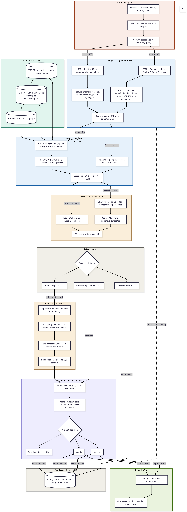

# HARIS Security Platform

HARIS is a cybersecurity platform that combines **red-team simulation** and **blue-team detection** with an auditable, graph-backed workflow.

- **Backend**: FastAPI microservices (`gateway`, `redteam`, `blueteam`, `blindspot`, `audit`)
- **Frontend**: React + Vite app served through nginx in Docker
- **Database**: Neo4j (graph storage + vector-index support)
- **Goal**: generate attacks, evaluate detections, and keep transparent forensic/audit traces

---

## Contents

- [Architecture at a Glance](#architecture-at-a-glance)
- [Quick Start (Docker, Recommended)](#quick-start-docker-recommended)
- [Local Development](#local-development)
- [Service Map](#service-map)
- [Environment Configuration](#environment-configuration)
- [Repository Layout](#repository-layout)
- [Useful Commands](#useful-commands)
- [Troubleshooting](#troubleshooting)
- [Project Documentation](#project-documentation)

---

## Architecture at a Glance



```text
User
  -> Frontend (React + Vite/nginx, :5173)
     -> /api
        -> Gateway (FastAPI, :8000)
           -> Red Team Service (:8001)
           -> Blue Team Service (:8002)
           -> Blind Spot Service (:8003)
           -> Audit Service (:8004)

Red Team  --+
Blue Team --+-> Neo4j (:7687 bolt, :7474 browser)
Blind Spot-+
Audit     -+
Gateway   -+
```

### Request flow

1. Frontend sends API requests to `/api/*`.
2. In Docker runtime, nginx in the frontend container proxies `/api` to `gateway:8000`.
3. Gateway exposes a shared `/api` router and forwards behavior to service routes.
4. Services persist and retrieve data from Neo4j through the repository layer.

---

## Quick Start (Docker, Recommended)

### 1) Create runtime environment

```bash
cp .env.example .env
```

Then update required secrets in `.env` (especially DB credentials and API keys).

### 2) (Optional) Add Neo4j plugins

If you use APOC or other plugins, place them under:

```text
neo4j/plugins/
```

### 3) Start the full platform

```bash
./start.sh
```

Equivalent direct command:

```bash
docker compose up --build -d
```

### 4) Open the app

- Frontend: `http://localhost:5173`
- Gateway health: `http://localhost:8000/health`

---

## Local Development

### Frontend-only dev mode (Vite)

```bash
./run-frontend.sh
```

This script auto-installs dependencies if `frontend/node_modules` is missing and starts Vite on `0.0.0.0:5173`.

### Frontend scripts

```bash
cd frontend
npm run dev
npm run build
npm run preview
```

### Backend tests (optional)

```bash
pytest api/tests
```

---

## Service Map

| Service | URL | Health Endpoint | Notes |
|---|---|---|---|
| Frontend | `http://localhost:5173` | n/a | nginx serves built UI and proxies `/api` |
| Gateway | `http://localhost:8000` | `/health` | unified API entrypoint |
| Red Team | `http://localhost:8001` | `/health` | attack simulation service |
| Blue Team | `http://localhost:8002` | `/health` | detection + analysis service |
| Blind Spot | `http://localhost:8003` | `/health` | blind-spot analysis service |
| Audit | `http://localhost:8004` | `/health` | audit timeline service |
| Neo4j Browser | `http://localhost:7474` | n/a | graph UI |

Gateway service map:

- `GET http://localhost:8000/health/services`

Gateway mounts API routers under `/api`:

- `/api/redteam`
- `/api/blueteam`
- `/api/rules`
- `/api/audit`
- `/api/events`

---

## Environment Configuration

Main config files:

- `.env.example` - template
- `.env` - active runtime values
- `api/app/config.py` - backend settings loading

Important variable groups:

- Neo4j connectivity (`NEO4J_*`)
- LLM/API settings (`CLAUDE_API_KEY`, `OPENAI_*`)
- Embeddings/classifier (`EMBEDDING_*`, `CLASSIFIER_*`, `REDTEAM_VECTOR_*`)
- Service URLs and ports (`*_PORT`, `*_URL`, `FRONTEND_PORT`)
- Security controls (`ALLOWED_ORIGINS`, `TRUSTED_HOSTS`, `INTERNAL_API_KEY`)

> Do not commit secrets from `.env`.

---

## Repository Layout

```text
.
├── api/                 # FastAPI services, routes, models, DB layer, pipelines
├── frontend/            # React + Vite app + nginx runtime config
├── neo4j/               # Neo4j init scripts and plugins mount directory
├── data/                # Dataset, KB, and model assets
├── scripts/             # Utility scripts (training, KB loading, generation)
├── docs/                # Architecture and technical docs
├── docker-compose.yml   # Multi-service orchestration
├── start.sh             # Start full stack (build + detached)
└── run-frontend.sh      # Frontend dev launcher
```

---

## Useful Commands

```bash
# Start everything
docker compose up --build -d

# Tail logs
docker compose logs -f

# Restart only frontend
docker compose up -d --build frontend

# Stop stack
docker compose down

# Recreate from scratch
docker compose up --build --force-recreate
```

---

## Troubleshooting

### Frontend `/api/*` returns 404/502

- Ensure gateway is up:

  ```bash
  docker compose ps
  docker compose logs --tail=100 gateway
  ```

- Ensure frontend container is running with nginx proxy config:

  ```bash
  docker compose logs --tail=100 frontend
  ```

### Services restart loop

- Check full logs for failing service:

  ```bash
  docker compose logs --tail=200 <service-name>
  ```

- Confirm `.env` is valid and not corrupted:

  ```bash
  cp .env.example .env
  # then re-apply your real secrets
  ```

### Neo4j connectivity issues

- Verify Neo4j container status and ports `7474/7687`
- Confirm `NEO4J_URI`, `NEO4J_USERNAME`, `NEO4J_PASSWORD` in `.env`

---

## Project Documentation

For deeper technical details:

- `docs/PROJECT_DOCUMENTATION.md` - comprehensive technical reference
- `docs/architecture.md` - architecture-focused deep dive
- `docs/HARIS_PROJECT_CONTEXT.md` - project context and intent
- `docs/transparency_note.md` - explainability and auditability note
