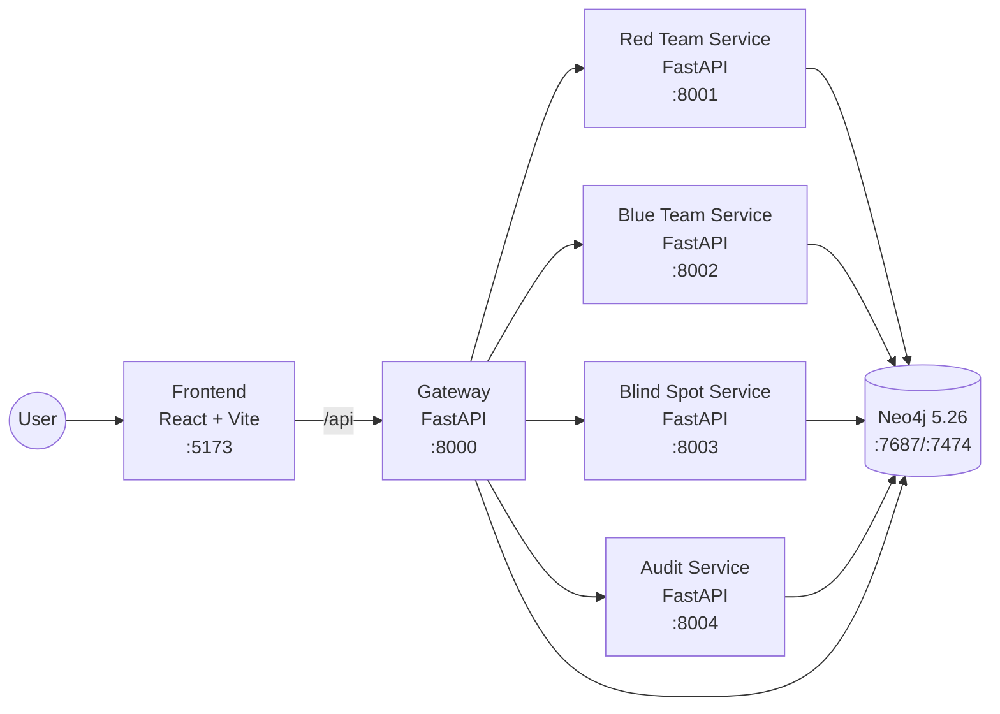

# HARIS Project Documentation

This document is the comprehensive technical reference for the HARIS repository.
It covers architecture, components, runtime behavior, operations, and development workflows.

## 1) Project Summary

HARIS is a Neo4j-backed cybersecurity platform organized as a monorepo with:

- FastAPI backend services (`api/`)
- React + Vite frontend (`frontend/`)
- Neo4j initialization scripts (`neo4j/init/`)
- Data, models, and utility scripts (`data/`, `scripts/`)

Core objective: support red-team simulation and blue-team detection workflows with graph-backed context (GraphRAG-style retrieval), auditability, and explainability outputs.

## 2) System Architecture

### 2.1 Deployment Architecture

Runtime topology is defined in `docker-compose.yml`.



### 2.2 Container and Network Boundaries

- All services run on Docker bridge network `app_net`.
- Exposed host ports (bound to `127.0.0.1`):
  - Neo4j browser: `7474`
  - Neo4j bolt: `7687`
  - Gateway: `8000`
  - Frontend: `5173`
- Internal service URLs are configured for service-to-service communication:
  - `http://redteam:8001`
  - `http://blueteam:8002`
  - `http://blindspot:8003`
  - `http://audit:8004`

### 2.3 Runtime Request Flows

#### Flow A: Frontend -> Gateway -> API routes

1. Frontend sends `/api/*` requests.
2. During development, Vite proxies `/api` to `http://gateway:8000`.
3. Gateway includes shared API router (`/api/redteam`, `/api/blueteam`, `/api/rules`, `/api/audit`, `/api/events`).

#### Flow B: Blue Team Evaluation Pipeline

`POST /evaluate` in Blue Team service executes:

1. Preprocessing
2. IOC extraction
3. Handcrafted feature building
4. Rule loading + rule matching
5. If matched: LLM evaluation + confidence fusion
6. If not matched: embeddings -> classifier -> graph context retrieval -> LLM evaluation
7. Confidence fusion + detection band resolution + decision resolution
8. XAI contributor computation + analyst explanation
9. Persist evaluation and audit linkage in Neo4j

#### Flow C: Red Team Attack Generation

`POST /run` in Red Team service executes:

1. Build attack samples using personas
2. Generate structured attack payload
3. Compute novelty using Neo4j vector similarity
4. Persist structured attack in Neo4j

### 2.4 Data and Persistence Architecture

- Persistence adapter: `api/app/db/repository.py`
- Neo4j driver lifecycle: `api/app/db/connection.py`
- Query modules: `api/app/db/queries/*`
- DB bootstrap/init:
  - `neo4j/init/01_constraints.cypher`
  - `neo4j/init/02_vector_index.cypher`
  - `neo4j/init/03_seed_data.cypher`

Repository methods are used by service apps to create and retrieve attacks, detections, audit events, and forensic timelines.

### 2.5 Architecture Patterns Used

- **Microservice separation inside one monorepo** (gateway, redteam, blueteam, blindspot, audit)
- **Shared router and model contracts** for API consistency
- **Repository pattern** for database access
- **Fallback resilience** in LLM and embedding paths
- **Explainability-first outputs** (XAI contributors + human-readable explanation fields)

## 3) Repository Structure and Responsibilities

```text
.
├── api/                 # FastAPI services, models, DB adapters, pipelines
├── frontend/            # React + Vite UI
├── neo4j/               # Neo4j init scripts and plugins mount path
├── data/                # Datasets, KB, trained model artifacts
├── scripts/             # Utility scripts (training, KB loading, dataset generation)
├── docs/                # Project documentation
├── docker-compose.yml   # Multi-service runtime orchestration
└── README.md            # Project overview + quick start
```

## 4) Backend Services Catalog

### Gateway (`api/app/service_apps/gateway.py`)

- Purpose: single API entrypoint and route aggregation.
- Endpoints:
  - `GET /health`
  - `GET /health/services`

### Red Team (`api/app/service_apps/redteam.py`)

- Purpose: run attack generation simulations.
- Endpoints:
  - `GET /health`
  - `POST /run`

### Blue Team (`api/app/service_apps/blueteam.py`)

- Purpose: evaluate attacks and produce detection decisions with provenance.
- Endpoints:
  - `GET /health`
  - `POST /evaluate`
  - `GET /forensics/{attack_id}`

### Blind Spot (`api/app/service_apps/blindspot.py`)

- Purpose: blind spot analysis endpoint.
- Endpoints:
  - `GET /health`
  - `POST /analyze`

### Audit (`api/app/service_apps/audit.py`)

- Purpose: expose audit timeline data.
- Endpoints:
  - `GET /health`
  - `GET /timeline`

## 5) API Routing Model

Shared router in `api/app/api/router.py` mounts:

- `/api/redteam`
- `/api/blueteam`
- `/api/rules`
- `/api/audit`
- `/api/events`

Dependency wiring utilities are in `api/app/api/deps.py` (`get_db`, `get_repository`, `get_redteam_agent`).

## 6) Configuration and Environment

Configuration source of truth:

- `.env.example` (template)
- `.env` (runtime values)
- `api/app/config.py` (`BaseSettings`, `env_file=".env"`)

### 6.1 Environment Variables

#### Neo4j and DB

- `NEO4J_URI`
- `NEO4J_USERNAME`
- `NEO4J_PASSWORD`
- `NEO4J_CONNECTION_TIMEOUT_SECONDS`
- `NEO4J_ACQUISITION_TIMEOUT_SECONDS`
- `NEO4J_PLUGINS`
- `NEO4J_INIT_ON_STARTUP`
- `NEO4J_INIT_DIR`

#### LLM / API Clients

- `CLAUDE_API_KEY`
- `OPENAI_API_KEY`
- `OPENAI_MODEL`
- `OPENAI_BASE_URL`
- `OPENAI_TIMEOUT_SECONDS`
- `OPENAI_MAX_RETRIES`

#### Embeddings / Vector Search

- `REDTEAM_VECTOR_INDEX_NAME`
- `REDTEAM_VECTOR_DIMENSIONS`
- `EMBEDDING_MODEL_NAME`
- `EMBEDDING_DEVICE`
- `EMBEDDING_CACHE_DIR`
- `EMBEDDING_FALLBACK_DIM`

#### Classifier

- `CLASSIFIER_MODEL_ROOT`
- `CLASSIFIER_ACTIVE_VERSION`

#### Security / Runtime Controls

- `ALLOWED_ORIGINS`
- `TRUSTED_HOSTS`
- `INTERNAL_API_KEY`

#### Ports and Inter-Service URLs

- `API_HOST`
- `API_PORT`
- `GATEWAY_PORT`
- `REDTEAM_PORT`
- `BLUETEAM_PORT`
- `BLINDSPOT_PORT`
- `AUDIT_PORT`
- `REDTEAM_URL`
- `BLUETEAM_URL`
- `BLINDSPOT_URL`
- `AUDIT_URL`
- `FRONTEND_PORT`

## 7) Local Development and Operations

## 7.1 Quick Start (Docker)

1. Copy environment template:

```bash
cp .env.example .env
```

2. Ensure APOC plugin jar exists under `neo4j/plugins/`.

3. Start stack:

```bash
docker compose up --build
```

Alternative helper script:

```bash
./start.sh
```

## 7.2 Red Team Kali Profile

```bash
docker compose --profile redteam up -d kali-redteam
```

## 7.3 Frontend Standalone Dev Mode

```bash
./run-frontend.sh
```

If `node_modules` is missing, the script installs dependencies automatically.

Frontend scripts (`frontend/package.json`):

```bash
npm run dev
npm run build
npm run preview
```

## 7.4 Service Health Checks

- Gateway: `GET http://localhost:8000/health`
- Gateway upstream map: `GET http://localhost:8000/health/services`
- Red Team: `GET http://localhost:8001/health`
- Blue Team: `GET http://localhost:8002/health`
- Blind Spot: `GET http://localhost:8003/health`
- Audit: `GET http://localhost:8004/health`

## 8) Data, Models, and Utility Scripts

### Data and Knowledge

- `data/dataset/` – curated datasets
- `data/kb/` – knowledge base artifacts

### Model Artifacts

- `data/models/blueteam/classifier/` – classifier versions and joblib artifacts
- `data/models/cache/` – embedding cache directory

### Utility Scripts

- `scripts/train_classifier.py`
- `scripts/load_kb_to_neo4j.py`
- `scripts/generate_tn_dataset.py`

## 9) Reliability, Transparency, and Security Notes

### Reliability

- `docker-compose.yml` uses `restart: unless-stopped` for all runtime services.
- Neo4j constraints and seed/index scripts are mounted and initialized at startup.
- Repository logic includes graceful fallback paths when DB operations fail.

### Transparency and Explainability

Blue Team responses include:

- `pipeline_trace`
- confidence values (`ml_confidence`, `llm_confidence`, `fused_confidence`)
- decision and band information
- XAI contributors and explanation fields
- audit linkage (`audit_event_id`, `payload_hash`)

### Security

- `.env` is gitignored.
- Internal API key and DB credentials are environment-driven.
- Trusted hosts and CORS allowed origins are configured in `config.py`.

## 10) Build, Test, and Verification

### Frontend

```bash
npm run build
```

### Backend

Dependencies are declared in `api/requirements.txt`.

Tests are located in `api/tests/`.

If running locally with Python environment prepared:

```bash
pytest api/tests
```

## 11) Documentation Index

- `README.md` – quick onboarding and endpoint summary
- `docs/architecture.md` – architecture-focused view
- `docs/HARIS_PROJECT_CONTEXT.md` – project context and rationale
- `docs/transparency_note.md` – explainability and audit stance
- `docs/PROJECT_DOCUMENTATION.md` – this comprehensive reference

## 12) Source-of-Truth File References

- Runtime orchestration: `docker-compose.yml`
- Service entrypoints: `api/app/service_apps/*.py`
- API routing: `api/app/api/router.py`
- Dependency wiring: `api/app/api/deps.py`
- Pipeline logic: `api/app/services/blueteam/pipeline.py`
- Persistence layer: `api/app/db/repository.py`
- Config loading: `api/app/config.py`
- Frontend proxy/runtime config: `frontend/vite.config.ts`
- Startup helpers: `start.sh`, `run-frontend.sh`
- Env template: `.env.example`
