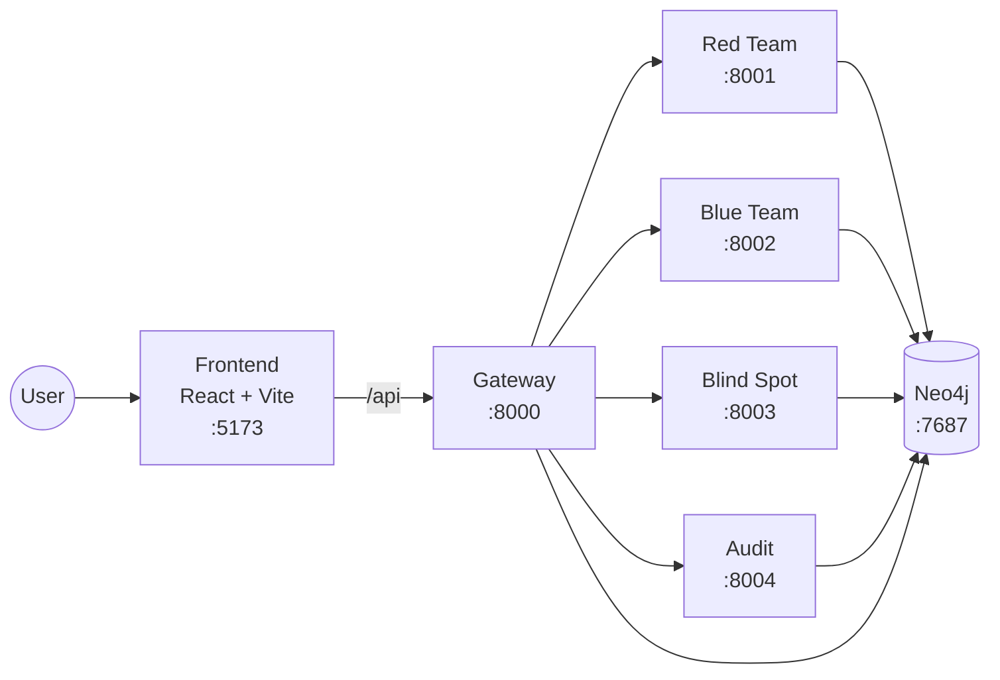

# HARIS Architecture

This document describes the runtime and logical architecture of HARIS.

## 1) Architectural Overview

HARIS is structured as a microservice-oriented platform:

- **Gateway** service exposes the unified API surface.
- **Red Team** service generates structured attack simulations.
- **Blue Team** service evaluates attacks using rules + ML + LLM + graph context.
- **Blind Spot** service runs blind-spot analysis.
- **Audit** service exposes audit timelines.
- **Neo4j** stores attacks, detections, audit events, and graph context.
- **Frontend** provides the user interface and communicates through `/api`.

## 2) Deployment Diagram

Deployment orchestration is defined in `docker-compose.yml` with all services attached to `app_net`.

## 3) Runtime Flows

### 3.1 Frontend to Backend Flow

1. Frontend sends requests to `/api/*`.
2. In dev mode, Vite proxies `/api` to `http://gateway:8000`.
3. Gateway includes and serves shared router routes under `/api`.

Key files:

- `frontend/vite.config.ts`
- `api/app/service_apps/gateway.py`
- `api/app/api/router.py`

### 3.2 Blue Team Evaluation Flow

When `POST /evaluate` is called:

1. Preprocess payload
2. Extract IOCs
3. Build handcrafted features
4. Apply rules
5. If no rule match:
   - Build embeddings
   - Run classifier
   - Retrieve graph context
   - Run LLM evaluator
6. Fuse confidence + resolve band + resolve decision
7. Generate XAI outputs
8. Persist evaluation and audit linkage in Neo4j

Key files:

- `api/app/service_apps/blueteam.py`
- `api/app/services/blueteam/pipeline.py`
- `api/app/db/repository.py`

### 3.3 Red Team Generation Flow

When `POST /run` is called:

1. Build attack payloads from personas
2. Generate structured attack fields
3. Calculate similarity against stored attacks (vector search)
4. Persist structured attack in Neo4j

Key files:

- `api/app/service_apps/redteam.py`
- `api/app/services/redteam/agent.py`
- `api/app/utils/llm.py`
- `api/app/db/repository.py`

### 3.4 Audit and Forensics Flow

- Blue Team persists audit-linked detections.
- Audit service returns timeline via `GET /timeline`.
- Blue Team supports forensic timeline retrieval via `GET /forensics/{attack_id}`.

Key files:

- `api/app/service_apps/audit.py`
- `api/app/service_apps/blueteam.py`
- `api/app/db/repository.py`

## 4) Logical Layers

1. **API Layer** (`api/app/service_apps`, `api/app/api/routes`)  
   Handles HTTP contracts and endpoint exposure.

2. **Application/Domain Layer** (`api/app/services`)  
   Implements business logic (detection pipeline, redteam generation, blindspot analysis).

3. **Persistence Layer** (`api/app/db`)  
   Encapsulates Neo4j access and query execution.

4. **Model/Contract Layer** (`api/app/models`)  
   Defines typed request/response structures.

5. **Presentation Layer** (`frontend/`)  
   User-facing interface that consumes API endpoints.

## 5) Configuration Architecture

Configuration is centralized in `api/app/config.py` using Pydantic Settings and `.env` loading.

Environment template is provided in `.env.example`.

Critical configuration areas:

- Neo4j connectivity
- OpenAI/LLM settings
- Embedding and vector index settings
- Classifier model path/version
- CORS and trusted hosts
- Service ports and inter-service URLs

## 6) Data and Graph Architecture

Neo4j graph lifecycle includes:

- Constraints creation
- Vector index creation
- Seed data loading

Initialization scripts:

- `neo4j/init/01_constraints.cypher`
- `neo4j/init/02_vector_index.cypher`
- `neo4j/init/03_seed_data.cypher`

Repository-driven persistence handles:

- attacks
- structured attacks
- blue-team detections
- audit events
- forensic timeline assembly

## 7) Reliability and Resilience

- Containers restart via `restart: unless-stopped`.
- Blue Team pipeline supports fallback behavior when LLM is unavailable.
- Embedding and vector search paths include fallback behavior.
- Health endpoints exist per service and at gateway level.

## 8) Architecture Decision Summary

- **Why microservices in one repo?** Independent service runtime boundaries with shared development workflow.
- **Why Neo4j?** Native fit for relationship-rich cyber events, context retrieval, and vector similarity workflows.
- **Why repository abstraction?** Keeps database concerns isolated from service logic and enables cleaner testing and evolution.
- **Why hybrid detection (rules + ML + LLM)?** Combines deterministic checks, statistical inference, and semantic/contextual reasoning with traceable outputs.
